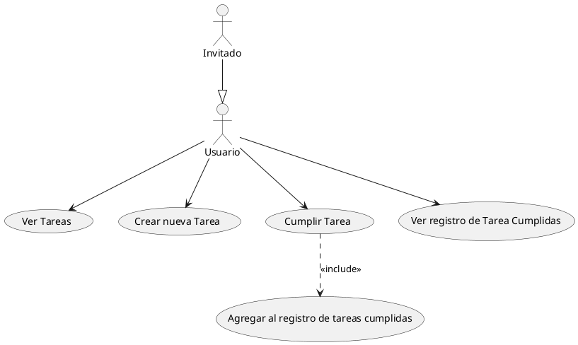

# 🍅🔵 Pomo Blue

### Características

* Uso Personal
* Offline APP

### ¿Que es un pomodoro?

Es una técnica planteada por _Francesco Cirillo_ para mejorar la administración del tiempo. Se basa en tener rangos de tiempo de en donde el usuario esta en suma concentración desarrollando una tarea previamente planteada por unos 25 minutos, en donde el usuario deberá no considerar otras tareas. y si por alguna razón debe de abandonar esta tarea es que el usuario deberá tomarse 5 minutos y luego reiniciar el pomodoro nuevamente.

_Ve más información [aquí](https://es.wikipedia.org/wiki/T%C3%A9cnica_Pomodoro)._

### ¿Que es lo que soluciona PomoBlue?

